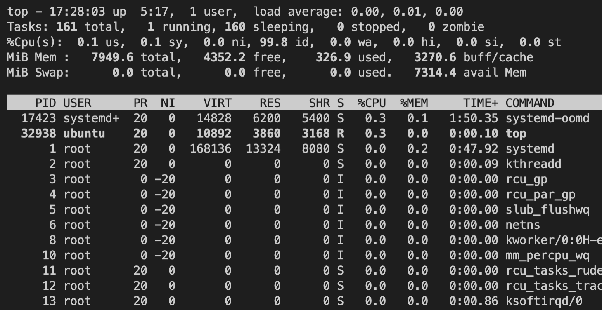
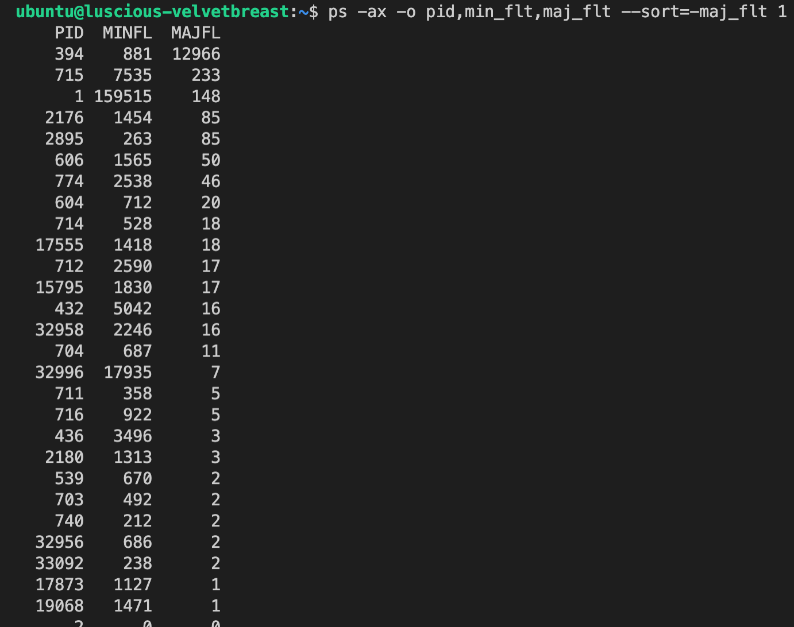
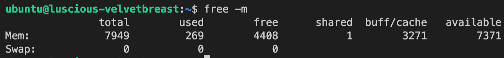
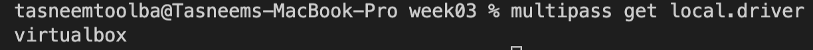
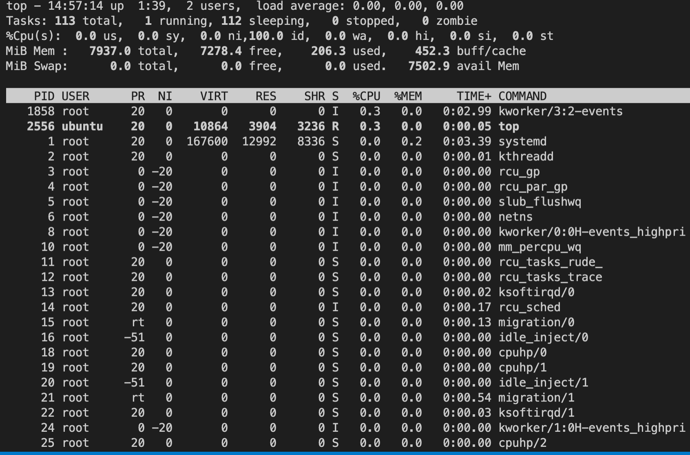
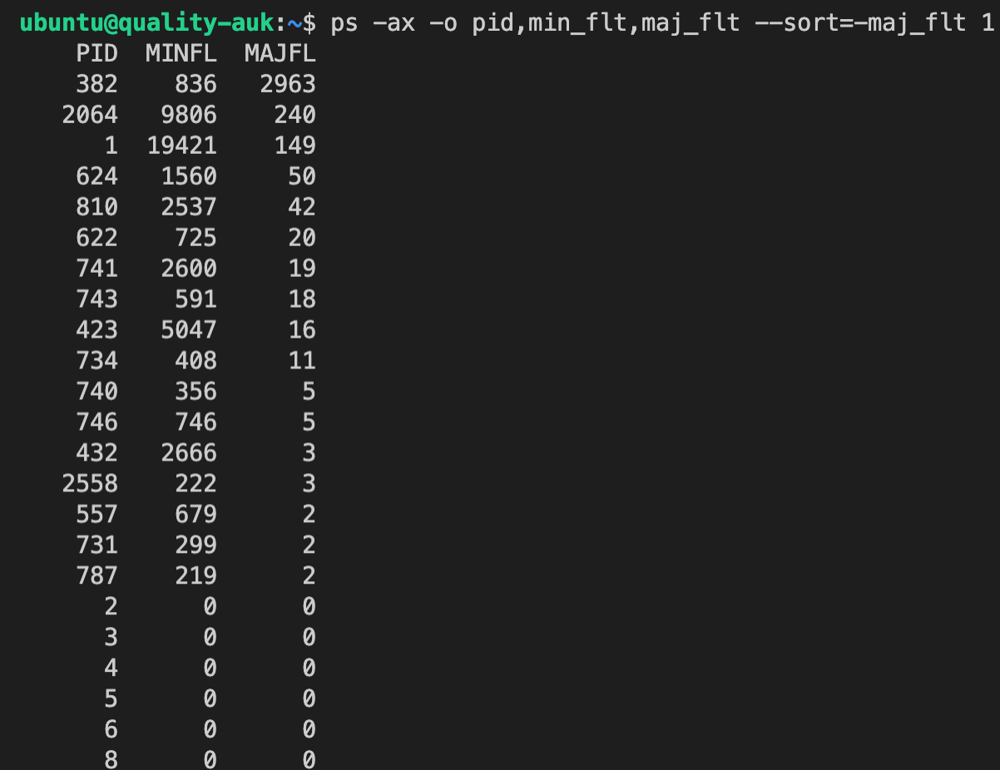
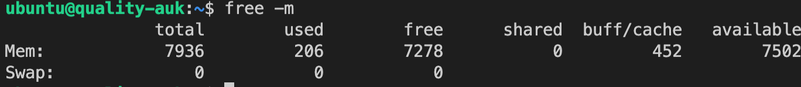

## Task 1

- Creating VM: `multipass launch --cpus 4 --disk 50G --mem 8G` 
- Installing apache server:
```sh
multipass exec luscious-velvetbreast -- sudo apt update
multipass exec luscious-velvetbreast -- sudo apt install apache2 -y
```
- Activating graphical interface: 
```sh
multipass shell luscious-velvetbreast
sudo apt update
sudo apt install ubuntu-desktop xrdp
```
- Then you can check the logs in Library/Logs


## Task 2

- CPU Utilization: command `top` with parameter P to sort the list of processes by processor usage:

- Number of page faults: To get the numbers of minor and major page faults sorted in descending order by major page fault param `ps -ax -o pid,min_flt,maj_flt --sort=-maj_flt 1`:

- Memory swaps: `free -m` to get info about swap space. The swapping size is 0 in the photo below:

- Performance testing using sysbench

| Test | Test params | Result time 1 | Result time 2 | Result time 3 | Result time 4 | Result time 5 | Avg time |
| --- | --- | --- | --- | --- | --- | --- | --- |
| 1 | –threads=2 --time=60 --cpu-max-prime=64000 | 285.84 events/sec | 287.34 events/sec | 288.77 events/sec | 288.14 events/sec | 288.29 events/sec | 287.67600 events/sec |
| 1 | –threads=10 --time=60 --cpu-max-prime=64000 | 560.41 events/sec | 573.77 events/sec | 457.29 events/sec | 411.07 events/sec | 412.27 events/sec | 482.96200 events/sec |
| 1 | –threads=100 --time=60 --cpu-max-prime=64000 | 445.78 events/sec | 439.48 events/sec | 423.92 events/sec | 418.04 events/sec | 425.08 events/sec | 430.46 events/sec |
| 2 | –num-threads=64 --test=threads --thread-yields=100 --thread-locks=2 | 10.0031 sec | 10.0094 sec | 10.0036 sec | 10.0022 sec | 10.0021 sec | 10.00408 sec |
| 3 | –threads=2 --time=60 memory --memory-oper=write | 14.9857 sec | 15.1020 sec | 15.2568 sec | 14.8105 sec | 14.2452 sec | 14.88004 sec |
| 3 | –threads=10 --time=60 memory --memory-oper=write | 13.1571 sec | 12.7789 sec | 13.1717 sec | 13.0010 sec | 12.8398 sec | 12.9897 sec |
| 3 | –threads=100 --time=60 memory --memory-oper=write | 12.5159 sec | 12.8286 sec | 12.6860 sec | 12.3366 sec | 11.9379 sec | 12.4610 sec |
| 4 | –test=memory --memory-block-size=1M --memory-total-size=10G | 0.7687 sec | 0.7302 sec | 0.7956 sec | 0.7239 sec | 0.8082 sec | 0.76532 sec |
| 5 (file size = 20G) | –test=fileio --file-total-size=20G --file-test-mode=rndrw --time=120 --max-time=300 --max-requests=0 | read: 16.66 MiB/s; written: 11.10 MiB/s | read: 16.28 MiB/s; written: 10.85 MiB/s | read: 16.00 MiB/s; written: 10.67 MiB/s | read: 23.15 MiB/s; written: 15.43 MiB/s | read: 30.05 MiB/s; written: 20.03 MiB/s | read: 20.428 MiB/s; written: 13.616 MiB/s |

## Task 4

- The driver used by multipass: `multipass get local.driver`:


According to the official doc, for my OS(MacOs intel) there are only 2 drivers available: hyperkit and virtualbox.

- I switched to driver virtualbox via command: `multipass set local.driver=virtualbox`:


- Creating the 2-nd VM: `multipass launch --cpus 4 --disk 50G --mem 8G`
- CPU Utilization: as in Task 2, using `top` command

- Number of page faults: repeating command in task 2

- Memory swaps: `free -m`

- Performance testing using `sysbench`

| Test | Test params | Result time 1 | Result time 2 | Result time 3 | Result time 4 | Result time 5 | Avg time |
| --- | --- | --- | --- | --- | --- | --- | --- |
| 1 | –threads=2 --time=60 --cpu-max-prime=64000 | 269.08 events/sec | 268.96 events/sec | 268.70 events/sec | 268.48 events/sec | 267.22 events/sec | 268.488 events/sec |
| 1 | –threads=10 --time=60 --cpu-max-prime=64000 | 482.48 events/sec | 483.70 events/sec | 481.72 events/sec | 482.29 events/sec | 478.89 events/sec | 481.816 events/sec |
| 1 | –threads=100 --time=60 --cpu-max-prime=64000 | 482.94 events/sec | 482.71 events/sec | 478.86 events/sec | 476.93 events/sec | 483.29 events/sec | 480.946 events/sec |
| 2 | –num-threads=64 --test=threads --thread-yields=100 --thread-locks=2 | 10.0057 sec | 10.0056 sec | 10.0040 sec | 10.0052 sec |10.0049 sec | 10.00508 sec |
| 3 | –threads=2 --time=60 memory --memory-oper=write | 14.9857 sec | 15.1020 sec | 15.2568 sec | 14.8105 sec | 14.2452 sec | 14.88004 sec |
| 3 | –threads=10 --time=60 memory --memory-oper=write | 13.1571 sec | 12.7789 sec | 13.1717 sec | 13.0010 sec | 12.8398 sec | 12.9897 sec |
| 3 | –threads=100 --time=60 memory --memory-oper=write | 13.3066 sec | 9.4551 sec | 10.7218 sec | 10.8790 sec | 9.8854 sec | 10.84958 sec |
| 4 | –test=memory --memory-block-size=1M --memory-total-size=10G | 0.7427 sec | 0.7544 sec | 0.7772 sec | 0.7153 sec | 0.8625 sec | 0.77042 sec |
| 5 (file size = 20G) | –test=fileio --file-total-size=20G --file-test-mode=rndrw --time=120 --max-time=300 --max-requests=0 | read: 16.43 MiB/s; written: 10.95 MiB/s | read: 16.07 MiB/s; written: 10.71 MiB/s | read: 16.29 MiB/s; written: 10.86 MiB/s | read: 16.79 MiB/s; written: 11.19 MiB/s | read: 16.95 MiB/s; written: 11.03 MiB/s | read: 16.506 MiB/s; written: 11.002 MiB/s |

### Difference:

Almost all of the performance metrics look the same with some minimal accuracy(host OS performs its own tasks in the parallel affecting a few the outcomes). However, from the test cases 1 and 3, I see that `hyperkit` driver performs better when there is a multithreading. If we run the test with bigger amount of threads, `hyperkit` driver overall performs better than `virtualbox` driver taking into account some precision error.