# Lab 6

## Part A: "Master" instance

I chose AWS in this lab.
### Steps:
1. I launched an EC2 instance in AWS with the smallest instance type(t2.micro)

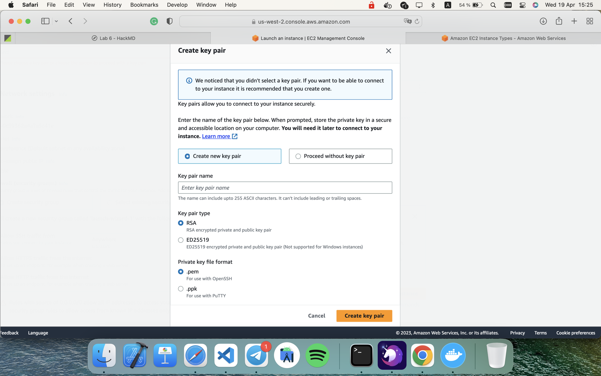
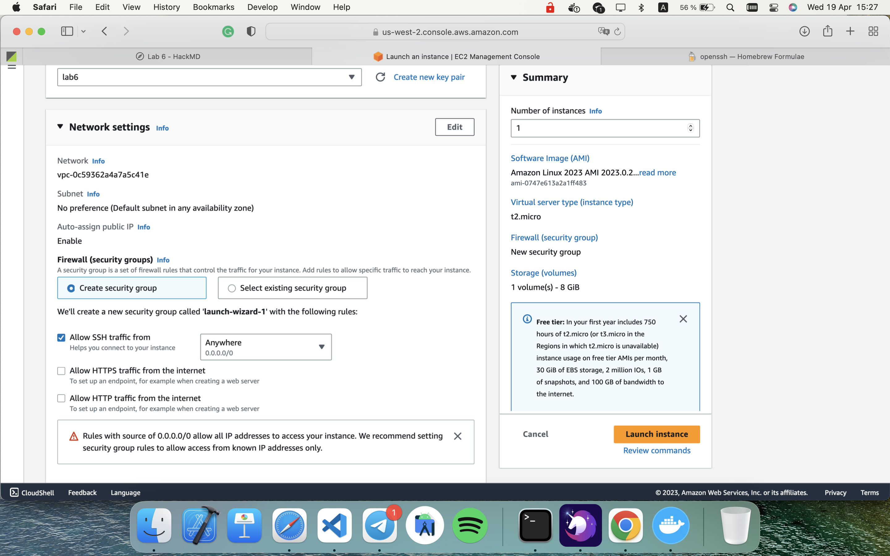
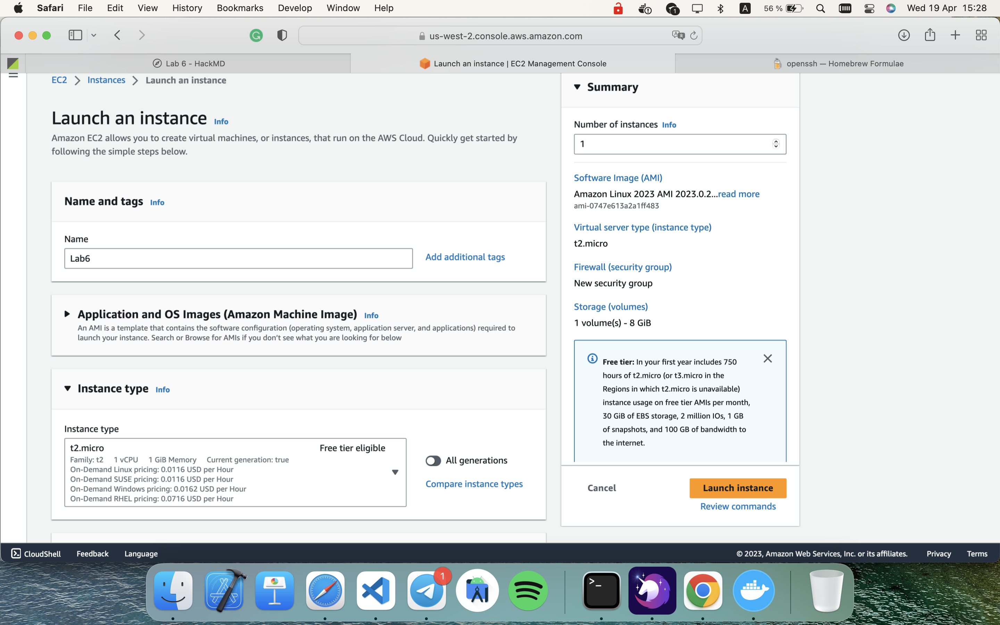

2. & 3. connecting to the instance, installing appache

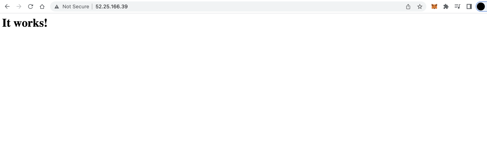

4. creating default page

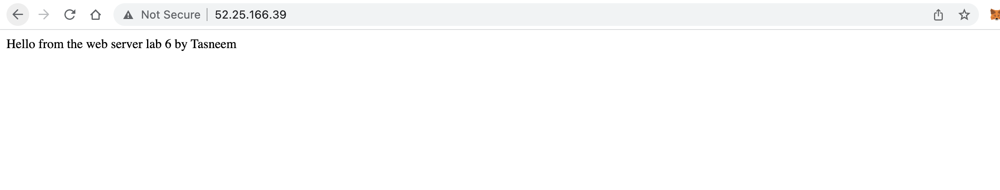

5. an image created successfully

## Part B: "Master" instance

### Steps:

6. launching 3 instances from the copy

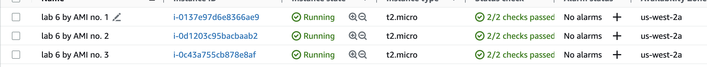

7. done
8. done
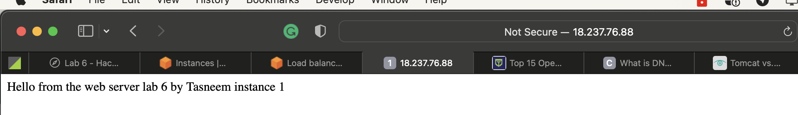
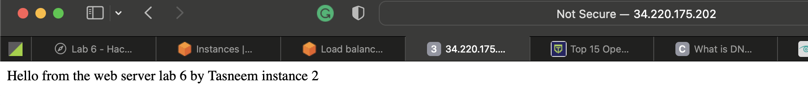
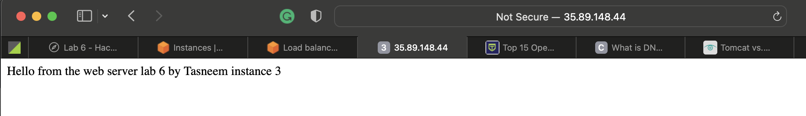
9. done
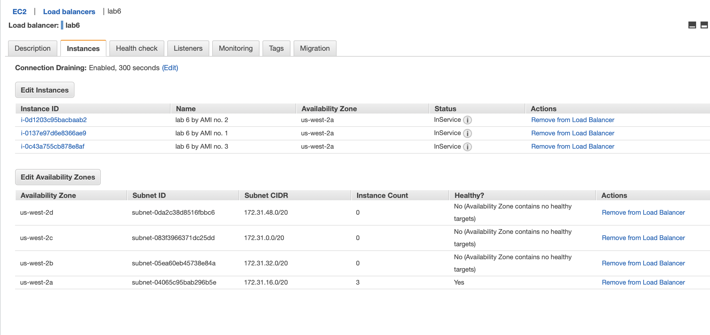
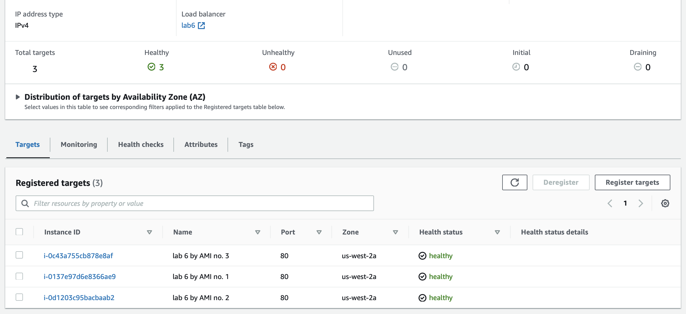
10. If I access  address, I see different html pages(each instance has its unique index.html page).

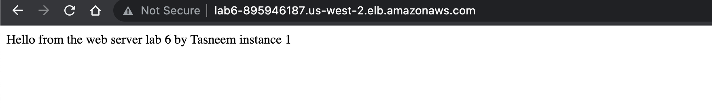
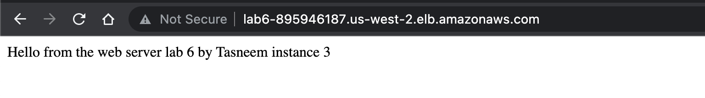

11. done
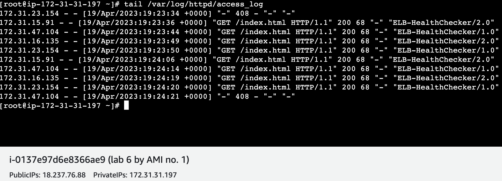
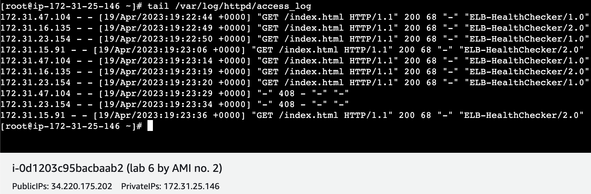
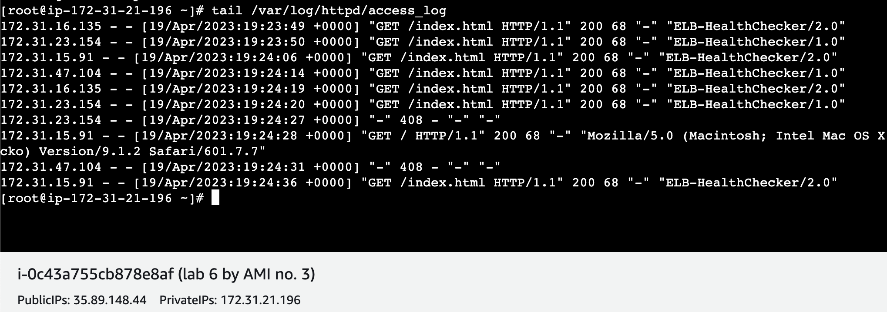
12. after changing the algorithm to Least outstanding requests
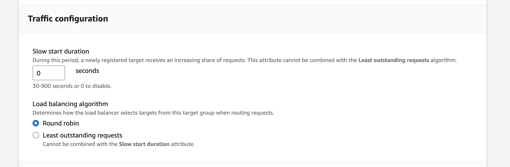

## Part C: "Master" instance

I used Locust
I stopped the test after couple of seconds

13. creating load test
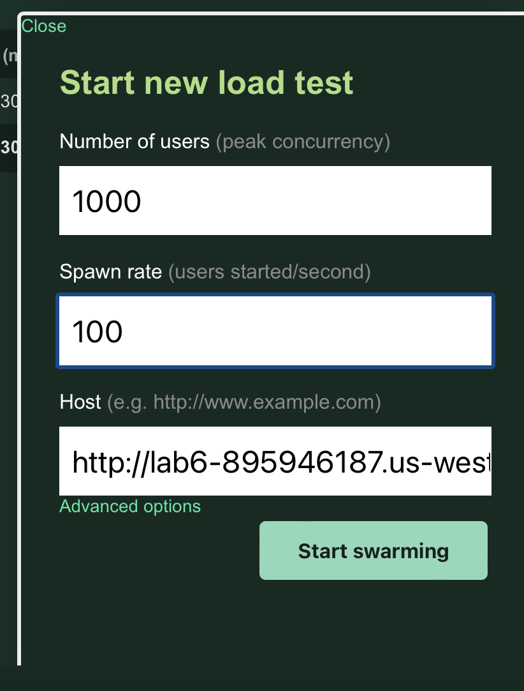
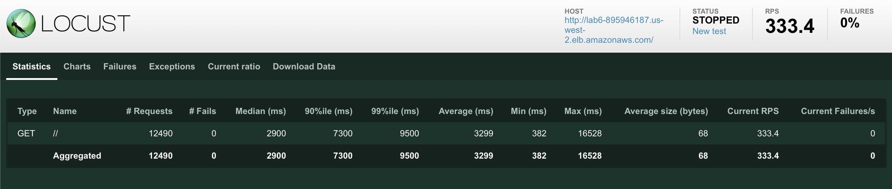

14.  
logs after running locust
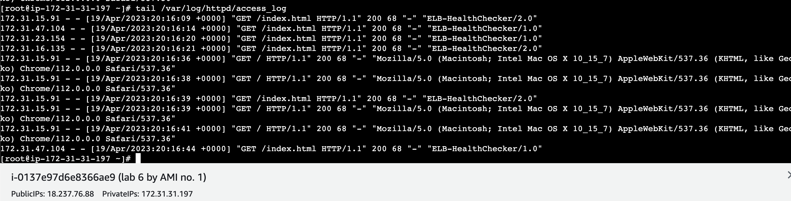
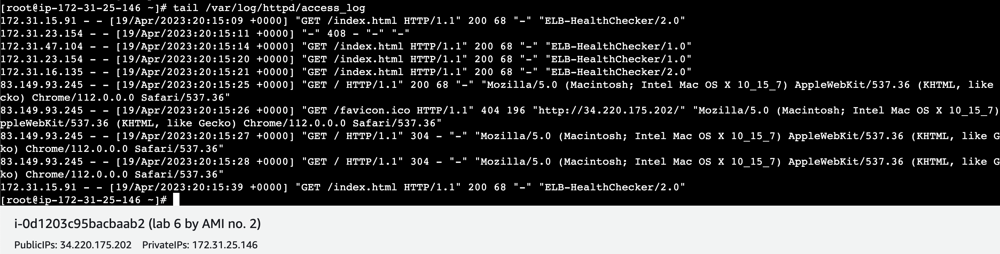
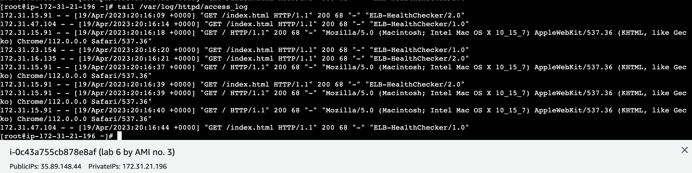

chart of locust

