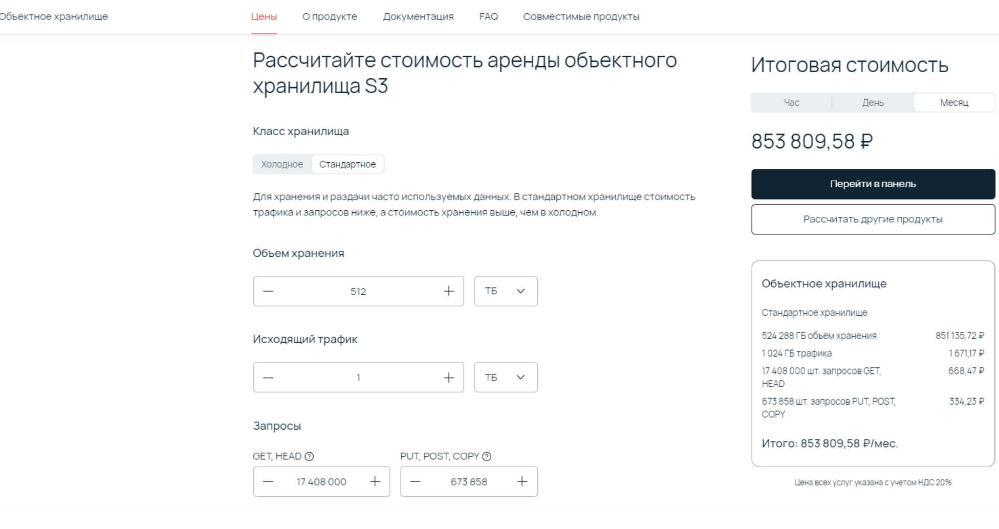
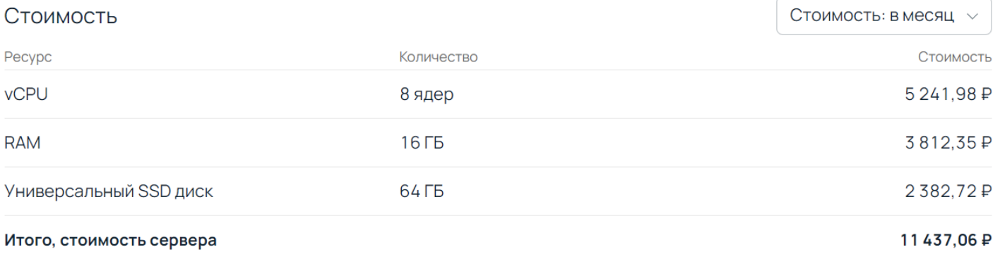
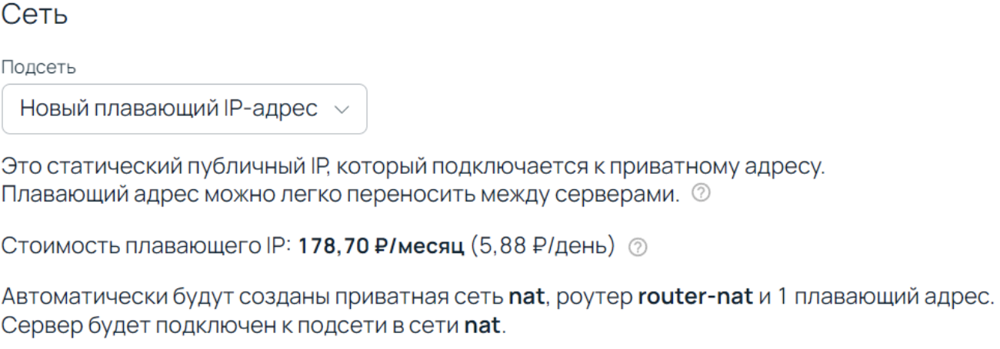
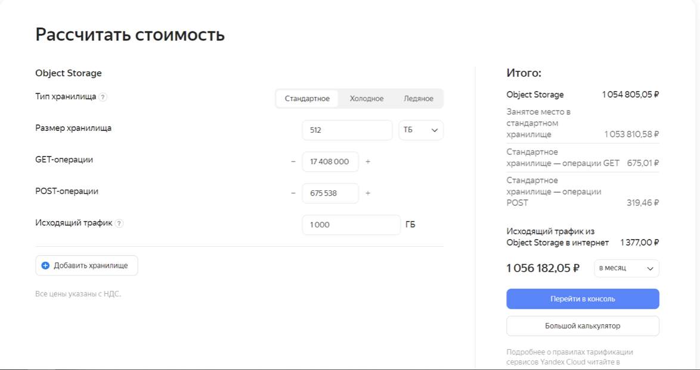
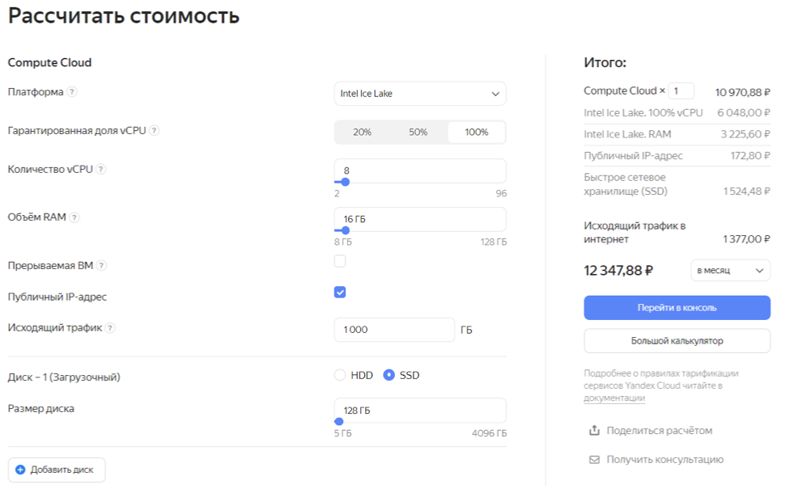

# Lab 7

## Cloud Computing Cost Analysis

assuming RAM size as 32 GB

We have the following requirements:

- 64 servers(in total)
- Total storage must be 512 TB(for s3 storage). Additionally, assuming that machines will consume small amount of space(stateless apps will be run), and each server will require 64 GB disk size.
- Each server must have at least 8 cores, 16GB RAM, 64 GB disk size.
  

Also, due to lack of information in the requirements, so we need to make the following assertions:

- ssuming our servers will produce at most 1 TB of outcoming traffic per month(it will be used to tariff the price by internet provider).
- Assuming there will be no router in our system, and each server must have public IP address.

## Rent (month cost) for the 1-st provider - Selectel

### Cost calculation

S3 storage of size 512TB consts around 851 396,84 rub / month.

Limitations of this configuration for s3 storage:

- Outcoming traffic 1TB per month.
- GET, HEAD requests - ~17.4M operations per month.
- PUT, POST, COPY requests - ~673K operations per month.

Price of VPS(EC2) instance in Selectel costs 11 437,06 rub / month.

Also, we should pay additionally for the static public IP address that will cost around 178,70 rub / month.

For 64 servers we should pay: 64 * (11 437,06 + 178,70) = 743 408,64 rub / month
Total price for Selectel = 743 408,64 + 851 396,84 ≈ 1 594 806 rub / month.
Month Selectel cost = 1 594 806 * M

## Rent (month cost) for the 2-nd provider - Yandex Cloud

### Cost calculation

As s3 storage Yandex suggests to use object storage. It has S3 API and some specific features(for example, automatic scaling and replication).

Yandex object storage of size 512TB costs around 1 056 182,05 rub / month.

Limitations of this configuration for s3 storage:

Outcoming traffic 1TB per month.
GET requests - ~17.4M operations per month.
POST requests - ~673K operations per month.

Instead of EC2, Yandex has its own Yandex Compute Cloud. One instance with the required configuration(and 1 public static IP address) costs 12 347,88 rub / month.

For 64 servers we should pay: 64 * 12 347,88 = 790 264,32 rub / month
Total price for Yandex Cloud = 1 056 182,05 + 790 264,32 ≈ 1 846 447 rub / month.
Month Yandex Cloud cost = 1 846 447 * M

## Own(self-hosted) solution

Assuming that we need to buy 64 physical machines where each must satisfy the requirements.

For CPU, I am going to choose out of Xeon processors line. After analysis of different Xeon models, I decided to choose Intel Xeon E5-2640 v3 as it has a good ratio of cpu frequency / power consumption. Moreover, its price price is fully adequate relatively to the other Xeon processors.

Also, I decided to buy the server from the company rather than buying everything separately. I chose Russian company ittelo and used their custom configurator(link to the server).

I obtained the following price for 1 server - 174 918 rub. By default, my configuration has 1 gbit Ethernet card and 250W power supply.

### Remarks:

As for s3 storage, I have decided to split it among 64 server, each server has additionally 8TB HDD. In this case, we may run additionally some software(for example, Minio) to organize distributed s3 storage.
To run applications fastly, I decided to add SSD disks(240 GB) to each server.

Also, it is great to put all the servers in 42U sever cabinets(each stores 18 servers), I chose to buy 4 of them. Each costs 101 750 rub.

Also, it is important to buy air conditioning system to cool the servers. I decided to buy 2 air conditioners assuming it will be enought to cool 4 server cabinets(40 m2). Each costs 40 900 rub(usually, installation is free). This model of air conditioner has low power consumption.

I neglected some periphery(for example, Ethernet cables), at it will not influence much.

#### In total, we need to spend 64 * 174 918 + 4 * 101 750 + 2 * 40 900 = 11 683 552 rub for the equipment only.

I made the following assumptions:

Energy price in my region(Tatarstan republic) for companies - 6.5 rub / kW-h (source).
For Internet provider, I found beeline that has tariff for business 100 MB/s. It costs 16 100 rub / month (link).
Assuming 1 server consumes on average ~150W per hour(CPU, mother board, 1 SSD, 1 HDD, 1 Ethernet card).

Average salary for sysadmin is around 70 000 rub / month in Tatarstan republic. For our case, assume that 1 person is enough to support the infrastructure.

### Own (month cost)

Assuming, PUE = 2.0 in our case.

Month cost = (Storage + Servers + Cooling system) + (Internet provider + sysadmin + energy cost (PUE=2.0)) * M

Energy cost = (servers + cooling system) * PUE * price for kW * number of days = (0,15 kW * 64 * 24 + 2 * 2,2 kW * 24) * 2,0 * 6,5 rub * 30 = 131040 rub / month

Month cost = 11 683 552 + (16 100 + 70 000 + 131 040) * M = 11 683 552 + 217 140 * M

## Selectel vs Own solution

1 594 806 * M = 11 683 552 + 217 140 * M

=> M ≈ 8.5. After rounding, M = 9.

After 9 months, our own solution becomes cheaper than Selectel.

## Yandex Cloud vs Own solution

1 846 447 * M = 11 683 552 + 217 140 * M

=> M ≈ 7.2. After rounding up, M = 8.

After 8 months, our own solution becomes cheaper than Yandex Cloud.